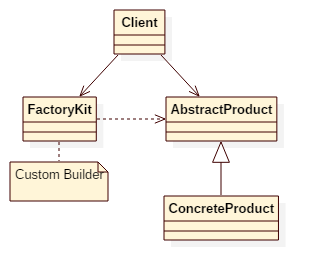

# Factory Kit Pattern

## Intent
Define a factory of immutable content with separated builder and factory interfaces.

## Applicability
Use the Factory Kit pattern when

* a class can't anticipate the class of objects it must create
* you just want a new instance of a custom builder instead of the global one
* you explicitly want to define types of objects, that factory can build
* you want a separated builder and creator interface

## Structure

## Participants
* **FactoryKit**
    - define an interface for operations that create product objects according to custom builder.
* **AbstractProduct**
    - declares an interface for a type of product object.
* **ConcreteProduct**
    - implements the AbstractProduct interface.
* **Client**
    - define custom builder for factory kit.
    - use factory kit to create project objects.

## Example
In this example, the client(App) creates one of the Weapon objects specified directly in the factory-kit instance.

Participants in this example:
* WeaponFactoryKit is the **FactoryKit**.
* Weapon is the **AbstractProduct**.
* Axe/Bow/Sword are the **ConcreteProduct**.
* App is the **Client**.

## Scala Tips
* use Map structure and lambda function to create define the custom builder.

## Reference
* [Java design patterns](https://github.com/iluwatar/java-design-patterns/tree/master/factory-kit)